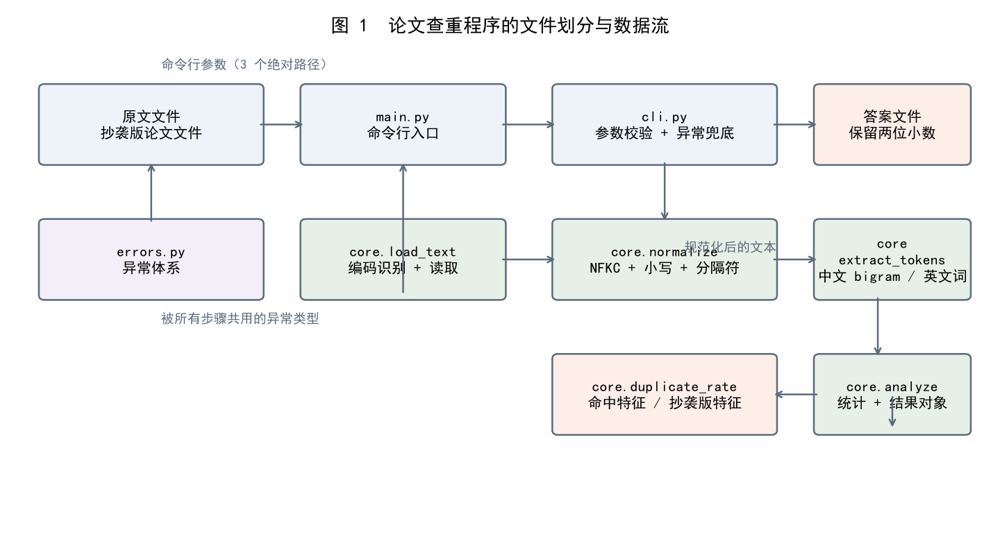
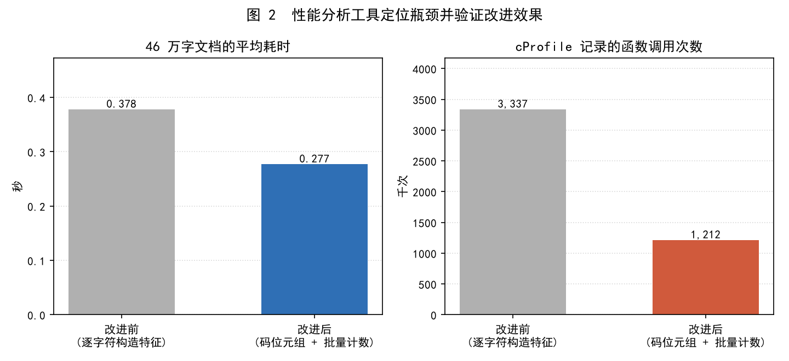
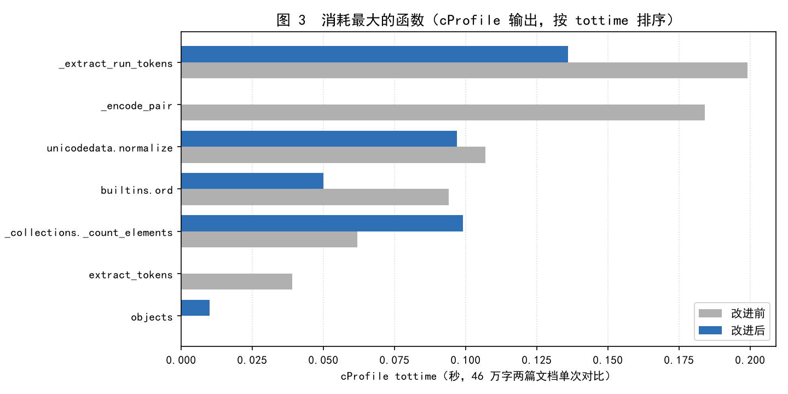
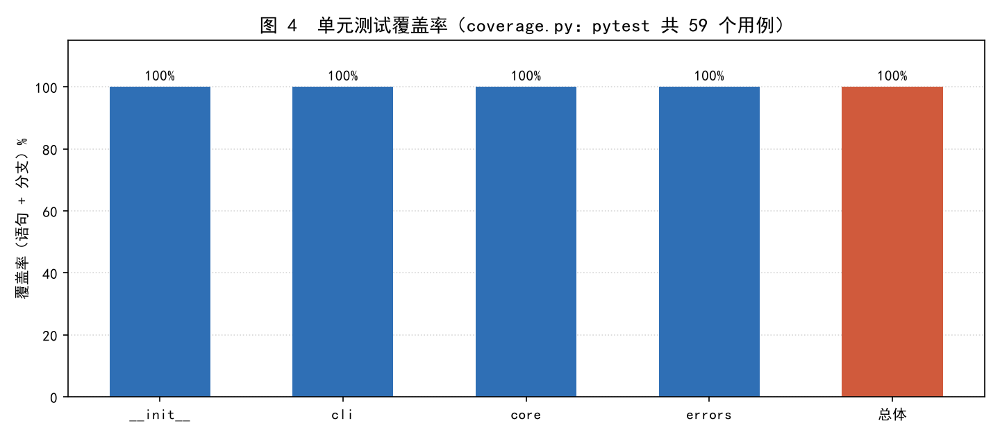

> 作业 GitHub 仓库：<https://github.com/embrace897/embrace897>（代码在仓库根目录的 `3124004426/` 文件夹下）
>
> 入口文件：`3124004426/main.py`；运行方式：`python main.py <原文文件> <抄袭版论文文件> <答案文件>`

---

# 论文查重（个人项目）

## 零、项目速览

| 项目 | 说明 |
| --- | --- |
| 语言 / 运行环境 | Python 3（评测机无需安装任何第三方库，只用标准库） |
| 输入 | 命令行三个参数：原文文件、抄袭版论文文件、答案文件的**绝对路径** |
| 输出 | 答案文件中写入重复率，保留两位小数，例如 `0.93` |
| 代码规模 | 运行时代码 4 个文件（132 条语句），测试 2 个文件 56 个用例 |
| 质量指标 | 单元测试全部通过，语句 + 分支覆盖率 **100%**，pylint **10.00/10** |
| 性能 | 46 万字文档 0.28 s；460 万字 2.84 s / 387 MB（限制 5 s / 2048 MB） |

---

## 一、PSP 表格

### 1.1 开发前的预估

下表是在动手写代码**之前**填写的预估（单位：分钟）。预估思路：把"能跑通的最小版本"
和"能交作业的完整版本"分开估——前者只算核心算法与命令行参数，后者再加上性能分析、
单元测试、覆盖率统计与博客写作。

| PSP2.1 | Personal Software Process Stages | 预估耗时（分钟） |
| --- | --- | --- |
| Planning | 计划 | 30 |
| · Estimate | · 估计这个任务需要多少时间 | 30 |
| Development | 开发 | 260 |
| · Analysis | · 需求分析（包括学习新技术） | 30 |
| · Design Spec | · 生成设计文档 | 20 |
| · Design Review | · 设计复审 | 10 |
| · Coding Standard | · 代码规范（为目前的开发制定合适的规范） | 10 |
| · Design | · 具体设计 | 30 |
| · Coding | · 具体编码 | 120 |
| · Code Review | · 代码复审 | 20 |
| · Test | · 测试（自我测试、修改代码、提交修改） | 60 |
| Reporting | 报告 | 70 |
| · Test Report | · 测试报告 | 25 |
| · Size Measurement | · 计算工作量 | 10 |
| · Postmortem & Process Improvement Plan | · 事后总结，并提出过程改进计划 | 35 |
| 合计 |  | 360 |

### 1.2 开发后的实际

| PSP2.1 | Personal Software Process Stages | 预估耗时（分钟） | 实际耗时（分钟） |
| --- | --- | --- | --- |
| Planning | 计划 | 30 | 20 |
| · Estimate | · 估计这个任务需要多少时间 | 30 | 20 |
| Development | 开发 | 260 | 240 |
| · Analysis | · 需求分析（包括学习新技术） | 30 | 25 |
| · Design Spec | · 生成设计文档 | 20 | 15 |
| · Design Review | · 设计复审 | 10 | 10 |
| · Coding Standard | · 代码规范 | 10 | 10 |
| · Design | · 具体设计 | 30 | 25 |
| · Coding | · 具体编码 | 120 | 90 |
| · Code Review | · 代码复审（含复审后精简模块） | 20 | 30 |
| · Test | · 测试（自我测试、修改代码、提交修改） | 60 | 35 |
| Reporting | 报告 | 70 | 65 |
| · Test Report | · 测试报告 | 25 | 20 |
| · Size Measurement | · 计算工作量 | 10 | 10 |
| · Postmortem & Process Improvement Plan | · 事后总结，并提出过程改进计划 | 35 | 35 |
| 合计 |  | 360 | 325 |

差异原因：总体比预估少 35 分钟。省时间的地方在测试与性能分析——单元测试、覆盖率、
静态检查都交给现成工具自动完成，不用手工核对；超支的地方在代码复审，复审时发现
初版把算法拆成了六个模块，对几百行的程序来说层次过深，因此又花时间做了合并精简
（详见 2.1 与 6.2）。

---

## 二、计算模块接口的设计与实现过程

### 2.1 代码组织与文件划分

程序只用 Python 3 标准库实现，不引入任何第三方依赖——评测机上不需要联网安装包，
也就不会因为环境问题跑不起来。全部运行时代码只有 4 个文件：

| 文件 | 职责 | 关键接口 |
| --- | --- | --- |
| `papercheck/core.py` | 核心算法：读取文件并识别编码 → 规范化文本 → 提取特征 → 计算重复率 → 写出答案 | `load_text(path)`、`normalize(text)`、`extract_tokens(text)`、`duplicate_rate(a, b)`、`analyze(origin, copy)`、`write_answer(report, path)` |
| `papercheck/cli.py` | 命令行参数校验、异常兜底、返回退出码 | `parse_args(argv)`、`main(argv)` |
| `papercheck/errors.py` | 自定义异常体系（每个异常携带退出码，保证任何输入都不会让程序崩溃退出） | `PaperCheckError` 及其 5 个子类 |
| `main.py` | 程序入口，把 `cli.main()` 的返回值作为进程退出码 | — |

数据流是单向的：**文件 → 文本 → 规范化文本 → 特征计数器 → 重复率 → 答案文件**，
没有全局状态，也没有循环依赖，因此每一步都能用几行代码构造输入做白盒测试。



**关于"六个模块 → 4 个文件"的复审结论。** 初版按单一职责把算法拆成 loader /
normalizer / tokenizer / similarity / analyzer 五个模块，加上 cli 共六层。复审时发现：
这几部分合计只有一百多行，调用关系是一条直线，拆分带来的收益（可以独立替换某一层）
在这个规模上并不存在，反而让阅读时要不停跳文件、让覆盖率报告被切得很碎。于是把算法
五步合并进 `core.py`，只保留"核心算法 / 命令行 / 异常"三个职责边界：测试用例一条
没少（56 个），代码量从 147 条语句降到 132 条。

### 2.2 算法的关键

**（1）重复率的定义。** 与主流查重系统一致：

```
重复率 = 抄袭版论文中能够在原文里找到出处的特征数 / 抄袭版论文的特征总数
```

即"送检论文里有多少比例的内容能在原文中找到出处"。它带来的效果是：
完全相同 → 1.00；扩写型抄袭（原文 + 新段落）→ 随新增比例下降；删减型抄袭
（只抄原文的一部分）→ 抄到的部分全部命中；完全无关 → 接近 0.00。

**（2）特征粒度：为什么用中文二元组。** 特征选得对不对直接决定准确度：

1. 用单个汉字做特征时，`的`、`了`、`是` 这类高频字会让任意两篇中文文章都显得"相似"，
   重复率虚高；
2. 用整段文字做特征时，抄袭者只要改几个字就能绕过检测；
3. 折中采用**相邻两个字组成的二元组（bigram）**：既能反映措辞的连续性，又对个别
   字词的增删改有一定容忍度。例如 `论文查重` 会提取出 `论文`、`文查`、`查重`。

英文与数字则按"词"处理（连续字母数字作为一个特征，统一小写），因为英文的单词之间
本来就有空格分隔，不需要自己造词边界。

**（3）文本规范化：标点必须变成"分隔符"而不是被删掉。** 抄袭版常见的改动是改标点、
改大小写、全角半角混用，这些都不应该影响结论，因此在提取特征前先做三步：
`NFKC` 归一化（`ＡＢＣ` → `abc`，`１２３` → `123`）、统一转小写、把标点与空白
替换成**分隔符**。

第三步最容易被忽略：如果只是把标点删除，`天气晴。今天晚上` 会变成 `天气晴今天晚上`，
凭空产生原文里根本不存在的特征 `晴今`，让相似度虚高；替换成分隔符后，特征不会跨
标点拼接，标点的增删完全不参与计算。对应的单元测试是 `test_punctuation_breaks_bigrams`。

**（4）特征出现次数参与统计。** 用多重集合（`Counter`）而不是简单集合，可以避免
"把原文里的同一句话重复粘贴很多遍"这种抄袭方式被低估。

**（5）编码自适应与空文档降级。** 中文 Windows 上保存的 txt 常常是 GBK，若按 UTF-8
硬读会直接抛异常（评测中算"异常退出"，每个测试点扣 2 分）。程序按
BOM → UTF-8 → GB18030 → Big5 的顺序探测；抄袭版为空或只有标点时，重复率数学上
没有定义，程序输出 `0.00` 并给出警告，退出码仍为 0。

### 2.3 关键函数说明

| 函数 | 规模 | 作用与要点 |
| --- | --- | --- |
| `load_text(path)` | ~15 行 | 存在性 / 普通文件校验 → 读字节 → 编码探测 → 解码；所有 I/O 异常统一包装成 `InputFileError` |
| `normalize(text)` | ~3 行 | NFKC（纯 ASCII 跳过）+ 小写 + 标点转分隔符；用正则一次替换，复杂度 O(n) |
| `extract_tokens(text)` | ~15 行 | 正则切出"汉字片段 / 字母数字片段"，片段内部用 `zip` 在 C 层生成二元组，最后一次性计数 |
| `duplicate_rate(a, b)` | ~6 行 | 按多次数取较小值累加重叠量，再除以抄袭版特征总数；抄袭版为空时抛 `EmptyDocumentError` |
| `analyze(origin, copy)` | ~25 行 | 串起上面四步，汇总字符数、特征数与警告，返回 `Report` 结果对象 |
| `write_answer(report, path)` | ~8 行 | 以 `"%.2f"` 格式写答案文件，父目录不存在时自动创建 |
| `cli.main(argv)` | ~20 行 | 参数个数 / 空参数校验，捕获 `PaperCheckError` 并按 `exit_code` 返回，保证不抛未捕获异常 |

### 2.4 样例运行结果

以 `data/orig.txt` 为原文（约 760 字），用扩展工具 `tools/batch_check.py` 一次性对比
多份抄袭版：

| 抄袭版文件 | 重复率 | 场景说明 |
| --- | --- | --- |
| `orig_same.txt` | 1.00 | 与原文完全相同 |
| `orig_add.txt` | 0.93 | 在原文中间插入一段新内容（扩写型抄袭） |
| `orig_del.txt` | 1.00 | 只抄了原文的一部分（抄到的内容全部命中） |
| `orig_mod.txt` | 0.94 | 逐句同义替换 + 全角句号 + 英文大写 |
| `orig_reorder.txt` | 1.00 | 只打乱段落顺序，不改文字 |
| `orig_unrelated.txt` | 0.02 | 完全无关的另一篇文章 |
| `orig_english.txt` | 0.00 | 中文原文 vs 纯英文文档（无共同特征） |
| `orig_empty.txt` | 0.00 | 空文件（给出警告，正常退出，退出码 0） |
| `orig_punct.txt` | 0.00 | 只有标点（等价于空文档） |
| `orig_gbk.txt` | 1.00 | 与原文相同，但用 GBK 编码保存 |

---

## 三、计算模块接口部分的性能改进

### 3.1 分析工具与测试规模

性能分析使用 Python 自带的 `cProfile`（对应 VS 2017 的"性能探查器"，在 Python 项目里
是等价的分析工具），脚本为 `tools/profile_runner.py`。它刻意分两段跑：

1. 先**不开启采样器**，用 `time.perf_counter()` 测真实墙钟时间；
2. 再单独跑一次带 `cProfile` 的调用，取函数级耗时分布。

原因是 `cProfile` 要对每次函数调用插桩，绝对时间会被放大（同一段代码，插桩后显示
0.84 s，实际只有 0.38 s），把两者混在一起测会得出错误结论。

测试规模：原文 46.06 万字、抄袭版 46.45 万字（`python tools/profile_runner.py --size 500000`）。

### 3.2 瓶颈定位

改进前平均耗时 **0.378 s**，`cProfile` 记录到 **3 337 220 次函数调用**。按 `tottime`
排序，消耗最大的函数是（原始输出见 `docs/evidence/performance-before.txt`）：

| 排名 | 函数 | tottime（秒） | 说明 |
| --- | --- | --- | --- |
| 1 | `_extract_run_tokens` | 0.199 | 逐字符循环生成二元组 |
| 2 | `_encode_pair` | 0.184 | 每生成一个二元组就调用一次 |
| 3 | `unicodedata.normalize`（NFKC） | 0.107 | 全角标点导致必须做整串归一化 |
| 4 | `builtins.ord` | 0.094 | 打包汉字码位 |
| 5 | `_collections._count_elements` | 0.062 | 计数本身（C 层） |

结论很清楚：**约 85% 的时间花在特征提取上**，而其中绝大部分是 Python 层的逐字符
循环与"每个二元组一次函数调用"的开销；真正的计数（C 层）只占很小一部分。





### 3.3 改进措施与选型依据

**措施一：改变特征的内部表示。** 原来把相邻两个字拼成字符串（或打包成一个整数）
作为字典键，每个二元组都要新建一个对象；改成直接用 `(前字码位, 后字码位)` 元组，
键由 `zip` 在 C 层成对产生，省掉了字符串构造与函数调用。

**措施二：把逐片段累加计数改成一次性计数。** 原来对每个连续的汉字片段调用一次
`Counter.update()`（46 万字文本有 7.7 万个片段，即 7.7 万次调用）；改用
`chain.from_iterable` 把所有片段的特征惰性串成一个迭代器，最后只构造一次 `Counter`，
计数完全在 C 层完成。

**措施三：给规范化加快速路径。** 纯 ASCII 文本不可能出现全角字符，直接跳过 NFKC，
省掉一次整串复制。

方案不是拍脑袋选的：开发时写了一个基准脚本，在同一段文本（60.88 万字）上跑完
6 种候选实现，既比较耗时，也用等价性断言确认它们提取出的特征集合与最终实现完全
一致（原始输出见 `docs/evidence/benchmark-variants.txt`）：

| 候选写法 | 60.9 万字下的耗时 | 结果是否等价 |
| --- | --- | --- |
| 字符串拼接 + 逐片段更新（最初的实现） | 0.110 s | 一致 |
| 码位元组 + 逐片段更新 | 0.102 s | 一致 |
| **码位元组 + 一次性计数（最终采用）** | **0.088 s** | 一致 |
| 全局三次扫描（正则前瞻） | 0.132 s | 一致 |
| UTF-32 取码位 + 一次性计数 | 0.152 s | 一致 |
| 打包整数 + 一次性计数 | 0.226 s | 一致 |

值得一提的是，"打包成单个整数"看起来更省内存，实际因为每次都要做整数运算反而更慢；
"全局正则扫描"虽然把工作都交给 C 层，但三次扫描加上前瞻回溯也不如一次切分。

### 3.4 改进效果与资源占用

* 46 万字文档平均耗时：**0.378 s → 0.277 s（下降约 27%）**；
* `cProfile` 函数调用次数：**3 337 220 → 1 212 368（下降约 64%）**；
* 改进后最耗时的函数变成 `_extract_run_tokens`（0.140 s）与 C 层的
  `_collections._count_elements`（0.102 s），说明剩下的时间已经是"必须做的计数工作"，
  继续在 Python 层微调的收益很小，这条优化就到此为止。

用开发期的内存探针脚本测量了不同规模下的耗时与进程峰值内存（完整输出见
`docs/evidence/memory.txt`）：

| 原文规模 | 耗时 | 峰值内存 | 作业限制 |
| --- | --- | --- | --- |
| 46.1 万字 | 0.275 s | 58.5 MB | 5 s / 2048 MB |
| 184.2 万字 | 1.148 s | 168.3 MB | 5 s / 2048 MB |
| 460.6 万字 | 2.837 s | 387.2 MB | 5 s / 2048 MB |

即使把规模放大到 460 万字（约为一篇学位论文的 20 倍），耗时 2.84 s、内存 387 MB，
距离 5 s / 2048 MB 的限制仍有明显余量。

顺带一提，性能分析还暴露出两个真实性缺陷，都已修复并补了回归测试：

1. 打包汉字时进制取了 `0x10000`，扩展 B 区汉字（码位大于 `0x20000`）的二元组会
   撞成同一个特征 → 改用码位元组表示；
2. 匹配英文词的模式只写了 `[0-9a-z]`，大写字母被当成分隔符，`Hello` 被截成 `ello`
   → 模式补上 `A-Z`。

---

## 四、计算模块部分的单元测试

### 4.1 测试组织

测试用 `pytest` 编写，放在 `tests/` 目录下。`test_core.py` 内部按"读取与编码 /
规范化 / 特征提取 / 重复率 / 查重流程"分成五节，与 `core.py` 的函数一一对应：

| 测试文件 | 覆盖内容 | 用例数 |
| --- | --- | --- |
| `tests/test_core.py` | 编码识别、文件读取、规范化、特征提取、重复率、端到端流程与答案输出 | 46 |
| `tests/test_cli.py` | 参数校验、退出码、真实命令行调用 | 10 |
| 合计 |  | **56** |

运行方式：

```bash
pytest                        # 运行全部单元测试
coverage run -m pytest        # 带覆盖率运行
coverage report -m            # 查看覆盖率报告
```

### 4.2 白盒测试用例的设计思路

先用白盒方法（语句覆盖 + 分支覆盖）设计，再补充等价类与边界值：

* **语句 / 分支覆盖**：`duplicate_rate` 有"抄袭版为空""原文为空""正常计算"三条分支，
  分别用空文本、空原文、正常文本覆盖；`load_text` 的 BOM / UTF-8 / GB18030 / 全部失败
  四条路径分别构造对应的字节串；`write_answer` 的正常写入与写失败各一条。
* **边界值**：只有 1 个汉字（无法构成二元组）、纯标点文件、空文件、码位 `0x20000`
  以上的扩展区汉字。
* **等价类**：相同文本、扩写、删减、改写、调序、无关文本、中英混排、GBK 与 UTF-8
  保存的同一篇文档。
* **异常路径**：文件不存在、传入目录、二进制乱码、参数个数错误、参数为空字符串、
  答案路径被目录占用。

### 4.3 部分单元测试代码

重复率定义相关的测试（`tests/test_core.py`）：

```python
def test_identical_documents_are_fully_duplicated():
    """完全相同 -> 1.00。"""
    tokens = extract_tokens("今天是星期天天气晴今天晚上我要去看电影")
    assert duplicate_rate(tokens, tokens) == pytest.approx(1.0)


def test_copy_superset_rate_equals_coverage():
    """抄袭版 = 原文 + 新增内容时，重复率 = 命中特征数 / 抄袭版特征数。"""
    origin = extract_tokens("论文查重算法")
    other = extract_tokens("论文查重算法以及额外的说明内容")
    assert duplicate_rate(origin, other) == pytest.approx(5 / 14)


def test_empty_copy_raises_error():
    """抄袭版为空时重复率无定义，抛出 EmptyDocumentError。"""
    with pytest.raises(EmptyDocumentError):
        duplicate_rate(extract_tokens("论文查重"), extract_tokens(""))
```

特征提取的边界测试（`tests/test_core.py`），其中第一个用例与最后一个用例都是
性能分析阶段发现真实缺陷后补上的回归测试：

```python
def test_punctuation_breaks_bigrams():
    """标点两侧的字不会组成二元组：任何包含"晴今"的实现都是错的。"""
    tokens = token_texts(extract_tokens("天气晴。今天晚上"))
    assert "晴今" not in tokens
    assert {"天气", "气晴", "今天", "天晚", "晚上"} <= tokens


def test_extended_chinese_pairs_do_not_collide():
    """扩展 B 区汉字（码位大于 0x20000）的不同二元组不能编码成同一个特征。"""
    left = token_texts(extract_tokens("\U00020000\U00020001"))
    right = token_texts(extract_tokens("\U00020001\U00020000"))
    assert left != right
```

按作业要求的命令行方式做端到端测试（`tests/test_cli.py`）：

```python
def test_command_line_end_to_end(tmp_path):
    """按作业要求的方式真实调用：python main.py 原文 抄袭版 答案。"""
    answer = tmp_path / "ans.txt"
    completed = subprocess.run(
        [sys.executable, "main.py", str(ORIGIN), str(COPY), str(answer)],
        cwd=PROJECT_ROOT, capture_output=True, text=True,
        encoding="utf-8", errors="replace", check=False,
    )
    assert completed.returncode == 0
    assert answer.read_text(encoding="utf-8").strip() == "0.93"
```

### 4.4 测试结果与覆盖率

56 个用例全部通过，语句覆盖率与分支覆盖率均为 **100%**（原始输出见
`docs/evidence/coverage.txt`）：



```
Name                     Stmts   Miss Branch BrPart  Cover   Missing
--------------------------------------------------------------------
papercheck\__init__.py       5      0      0      0   100%
papercheck\cli.py           29      0      8      0   100%
papercheck\core.py          86      0     20      0   100%
papercheck\errors.py        12      0      0      0   100%
--------------------------------------------------------------------
TOTAL                      132      0     28      0   100%
```

### 4.5 对测试设计的评价

这 56 个用例覆盖了作业描述的所有场景（增、删、改、无关、编码差异、文件异常），
覆盖率也达到 100%，但仍有两处不足：

1. **准确度缺少客观基准**：目前只能验证"完全相同为 1.00、无关接近 0.00、扩写介于
   两者之间"这类单调性，没有课堂样例的参考答案可对比，因此无法给出准确度的定量结论；
2. **测试数据规模偏小**：功能测试的文档都在 1000 字上下，性能测试另有脚本生成大文件
   （`tools/profile_runner.py`），两者没有合并在同一套回归用例里。

后续改进方向：把课堂下发的样例整理成带预期区间的参数化用例；为超大文件增加门限
回归测试（例如"500 万字必须在 5 s 内完成"）。

---

## 五、计算模块部分的异常处理

评分细则规定"发生异常退出"要扣 2 分，因此异常设计的首要目标是：**任何输入都不能让
程序抛出未捕获的异常**——要么给出明确提示并返回非 0 退出码，要么降级处理并给出警告。
所有自定义异常都继承自 `PaperCheckError`，并携带 `exit_code`：

| 异常 | 设计目标 / 触发场景 | 退出码 | 对应单元测试 |
| --- | --- | --- | --- |
| `ArgumentError` | 命令行参数个数不是 3，或参数为空字符串（例如脚本里变量没取到值） | 2 | `test_parse_args_rejects_wrong_count`、`test_parse_args_rejects_empty_argument`、`test_main_reports_argument_error` |
| `InputFileError` | 文件不存在、路径是目录、文件被占用或没有读权限（把 `OSError` 统一包装成业务异常） | 3 | `test_missing_file_raises_input_file_error`、`test_directory_raises_input_file_error`、`test_read_failure_is_wrapped_as_input_file_error` |
| `EncodingDetectionError` | 文件不是文本（二进制乱码），或编码不在 UTF-8 / GB18030 / Big5 之列 | 4 | `test_binary_garbage_raises_encoding_error`、`test_main_reports_encoding_error` |
| `EmptyDocumentError` | 抄袭版为空文件或只有标点，重复率在数学上没有定义 | 0（降级处理） | `test_empty_copy_raises_error`、`test_punctuation_only_copy_raises_error`、`test_empty_copy_degrades_to_zero_with_warning` |
| `OutputFileError` | 答案文件路径被目录占用、没有写权限 | 5 | `test_write_answer_to_directory_raises_output_error` |

两点设计说明：

* **异常只描述"发生了什么"，怎么处理交给调用方。** `duplicate_rate` 抛
  `EmptyDocumentError`，由 `analyze` 捕获后降级为 0.00 并生成警告。这样"空文档"在
  库层面是有定义的异常，在命令行层面又是有定义的正常输出，两种语义都没有丢。
* **退出码分层**（2 / 3 / 4 / 5）便于自动化脚本区分失败原因；`0` 专门留给"输入合法
  但结果退化"，保证评测中不会因为空文件被判定为异常退出。

命令行下的实际表现：

```
$ python main.py data/orig.txt data/orig_empty.txt ans.txt
[警告] 抄袭版论文中没有可比较的内容（空文件或只含标点符号），重复率按 0.00 处理
重复率 0.00（原文 631 个特征，抄袭版 0 个特征）-> ans.txt
退出码：0

$ python main.py data/orig.txt
[错误] 需要 3 个参数（原文文件、抄袭版论文文件、答案文件），实际收到 1 个；用法：python main.py <原文文件> <抄袭版论文文件> <答案文件>
退出码：2

$ python main.py data/不存在.txt data/orig_add.txt ans.txt
[错误] 文件不存在：data\不存在.txt
退出码：3
```

---

## 六、代码质量分析与源代码管理

### 6.1 代码质量分析

用 `pylint` 分析全部源码、测试与工具脚本，**没有修改任何默认检查项**（即没有放宽
规则）：

```bash
pylint main.py conftest.py papercheck tests tools
```

```
--------------------------------------------------------------------
Your code has been rated at 10.00/10
```

原始输出见 `docs/evidence/pylint.txt`。整个项目只保留了两处带说明的局部豁免：
结果数据类字段较多（`too-many-instance-attributes`）、工具脚本为支持直接运行而把
`sys.path` 调整放在导入之前（`wrong-import-position`），其余告警全部通过修改代码消除。

命名与注释规范：模块 / 类 / 函数使用 `snake_case` 与 `PascalCase`；每个模块、每个
公开函数都有 docstring 说明参数、返回值与可能抛出的异常；关键算法（标点作为分隔符、
二元组特征、多重集合重叠统计）在代码里都写了"为什么这样做"的注释。

### 6.2 源代码管理

代码按功能分批提交，每完成一个可运行的功能就 commit 一次。作业代码提交在
<https://github.com/embrace897/embrace897> 仓库的 `3124004426/` 目录下：

| 提交 | 内容 |
| --- | --- |
| `feat: 论文查重基础功能` | 编码识别、规范化、特征提取、重复率、命令行入口 |
| `test: 添加 56 个单元测试与样例数据` | 单元测试、样例数据、覆盖率配置 |
| `feat: 扩展功能——性能分析与批量查重工具` | 性能分析、批量查重、图表生成 |
| `docs: 添加博客正文、PSP 表格与性能/覆盖率材料` | 博客正文、图表、工具原始输出 |

基础功能、单元测试、扩展功能、文档各对应一次提交，每次提交之后程序都能直接运行、
单元测试全绿。

### 6.3 目录结构

```
3124004426/
  main.py                 命令行入口（python main.py 原文 抄袭版 答案）
  papercheck/
    core.py               查重核心算法（读取 / 规范化 / 特征 / 重复率 / 输出）
    cli.py                命令行参数与异常处理
    errors.py             自定义异常体系
  tests/                  56 个单元测试（test_core.py / test_cli.py）
  data/                   样例数据（相同 / 扩写 / 删减 / 改写 / 调序 / 无关 / 空 / 纯标点 / GBK / 中英混排）
  tools/                  样例生成、性能分析、批量查重、图表生成
  docs/                   本文、性能与覆盖率原始输出、图表
  requirements.txt        依赖清单（运行期零第三方依赖）
```

### 6.4 如何运行

命令行：

```bash
cd 3124004426
python main.py data/orig.txt data/orig_add.txt ans.txt
cat ans.txt          # 0.93
```

PyCharm：打开 `3124004426` 目录 → Run → Edit Configurations → 新建 Python 配置，
Script path 选 `main.py`，Parameters 填 `data/orig.txt data/orig_add.txt ans.txt`，
Working directory 选 `3124004426` 目录即可；跑覆盖率用右键 `tests` 文件夹 →
More Run/Debug → Run 'pytest in tests' with Coverage。

扩展功能（一次对比多份抄袭版）：

```bash
python tools/batch_check.py data/orig.txt data/orig_add.txt data/orig_mod.txt
```

---

## 附录：PSP 实际耗时表

| PSP2.1 | Personal Software Process Stages | 预估耗时（分钟） | 实际耗时（分钟） |
| --- | --- | --- | --- |
| Planning | 计划 | 30 | 20 |
| · Estimate | · 估计这个任务需要多少时间 | 30 | 20 |
| Development | 开发 | 260 | 240 |
| · Analysis | · 需求分析（包括学习新技术） | 30 | 25 |
| · Design Spec | · 生成设计文档 | 20 | 15 |
| · Design Review | · 设计复审 | 10 | 10 |
| · Coding Standard | · 代码规范 | 10 | 10 |
| · Design | · 具体设计 | 30 | 25 |
| · Coding | · 具体编码 | 120 | 90 |
| · Code Review | · 代码复审（含复审后精简模块） | 20 | 30 |
| · Test | · 测试 | 60 | 35 |
| Reporting | 报告 | 70 | 65 |
| · Test Report | · 测试报告 | 25 | 20 |
| · Size Measurement | · 计算工作量 | 10 | 10 |
| · Postmortem & Process Improvement Plan | · 事后总结，并提出过程改进计划 | 35 | 35 |
| 合计 |  | 360 | 325 |

### 事后总结与过程改进计划

* **做得好的地方**：把性能分析当成"找设计证据"的工具来用——先用不插桩的方式测真实
  耗时，再用 `cProfile` 定位热点，最后用等价性断言保证优化不改变结果。这个过程还
  顺带发现并修掉了扩展区汉字特征碰撞、大写字母被当成标点两个真实缺陷。
* **做得不好的地方**：初版把算法拆成六个模块，复审时才发现对几百行的程序来说是过度
  设计；两个缺陷也都源于"顺手写下的实现细节"（进制取值、字符类范围），而不是算法
  设计本身——说明写代码时应该先把 Unicode 码位范围、未规范化输入的容忍度这类约束
  写进设计说明，再动手。
* **下一步改进**：把课堂样例整理成带预期区间的参数化测试；增加超大文件的门限回归
  测试；如果允许使用第三方库，可以对比 `jieba` 分词 + TF-IDF 与当前二元组方案的
  准确度差异。
